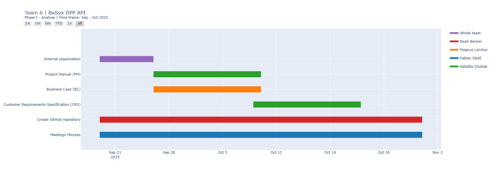
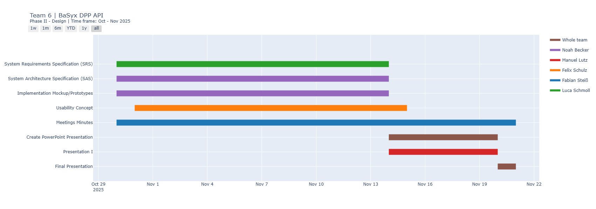
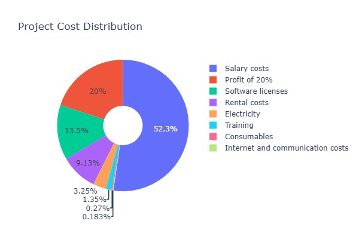

# Business case: BaSyx DPP API

## Project 6: API for the Digital Product Passport (DPP) in the BaSyx Framework

## Customer
|Name|Mail|
|---|---|
|Markus Rentschler|rentschler@lehre.dhbw-stuttgart.de|
|Pawel Wojcik|pawel.wojcik@lehre.dhbw-stuttgart.de|

---

## Definition of tasks
 > **DIN EN 18222** “Digital product passport – Application programming interfaces (APIs) for product passport lifecycle management and searchability” describes a REST API that is to be implemented in the BaSyx framework as part of this task, both on the backend and frontend sides. The exact task can be found <a href="https://github.com/DHBW-TINF24F/.github/blob/main/project6_basyx_dpp_api.md">here</a>.

---

## Team 6
| **Name** | **e-Mail** | **Position** |
| :--- | :--- | :--- |
|  Nataliia Chubak | <inf24271@lehre.dhbw-stuttgart.de>|Project Manager |
|  Luca Schmoll | <inf24137@lehre.dhbw-stuttgart.de> |Product Manager |
|  Magnus Lörcher | <inf24155@lehre.dhbw-stuttgart.de>|Product Manager |
| Manuel Lutz |<inf24224@lehre.dhbw-stuttgart.de> |Test Manager | 
|  Noah Becker | <inf24038@lehre.dhbw-stuttgart.de> |System Architect |
|  Fabian Steiß | <inf24138@lehre.dhbw-stuttgart.de> |Technical Writer |
|  Felix Schulz |<inf24075@lehre.dhbw-stuttgart.de> |UI-Designer |

---

## Version Control

| **Version** | **Date** | **Author** | **Comment** |
| :--- | :--- | :--- | :--- |
| 1.0 | 26.09.2025 | Nataliia Chubak | Initial Business Case (BC) |
| 1.1 | 27.09.2025 | Nataliia Chubak | Update BC and financial calculation |
| 1.2 | 10.10.2025 | Luca Schmoll | Convert to Markdown |
| 1.3 | 02.11.2025 | Nataliia Chubak | Add Gantt diagram |
---

## Table of Contents

1.  [Description and Goals](#description-and-goals)
2.  [Expected Working Hours](#expected-working-hours)
3.  [Timeline](#timeline)
4.  [Cost Calculation](#cost-calculation)
5.  [Risks](#risks)
6.  [Offer](#offer)

---

## Description and Goals

The goal of the project is to develop a **two-sided (Backend-Frontend) implementation of the REST-API Digital Product Passport (DPP)** in accordance with the **DIN EN 18222 standard** within the **BaSyx framework** to ensure standardized lifecycle management and DPP search.

The relevance of this project lies in **improving the DPP search capability** and **increasing service efficiency**. By providing a ready-made backend and frontend product for DIN EN 18222 standards, the project enables companies to implement the necessary digital solutions more quickly.

---

## Expected Working Hours

Each member of the project has **180 hours** available. The distribution of these hours is detailed below (Table 1).

| **Activity** | **Nataliia Chubak** | **Magnus Lörcher** | **Luca Schmoll** | **Fabian Steiß** | **Noah Becker** | **Manuel Lutz** | **Felix Schulz** | **Total Hours** |
| :--- | :---: | :---: | :---: | :---: | :---: | :---: | :---: | :---: |
| **Product Analysis** | 20 | 20 | 20 | 0 | 0 | 0 | 0 | 60 |
| **Customer Dialogue** | 10 | 5 | 5 | 0 | 0 | 0 | 0 | 20 |
| **Leading Project** | 40 | 10 | 10 | 0 | 0 | 0 | 0 | 60 |
| **Research** | 15 | 15 | 15 | 15 | 15 | 15 | 15 | 105 |
| **Documentation** | 25 | 15 | 15 | 30 | 20 | 25 | 25 | 155 |
| **Coding** | 45 | 85 | 85 | 95 | 105 | 75 | 100 | 590 |
| **Testing** | 0 | 0 | 0 | 0 | 0 | 30 | 5 | 35 |
| **Meetings** | 15 | 15 | 15 | 15 | 15 | 15 | 15 | 105 |
| **GitHub Management** | 5 | 10 | 10 | 20 | 20 | 15 | 15 | 95 |
| **Presentation** | 5 | 5 | 5 | 5 | 5 | 5 | 5 | 35 |
| **Total** | **180** | **180** | **180** | **180** | **180** | **180** | **180** | **1260** |

 <i>Table 1. Expected working hours</i> 
  

---

## Timeline

The total time frame for this project is **11 weeks** (26.09.2025 – 31.05.2026), with a significant break from 1.12.2025 – 8.03.2026 where team members will be working in their companies.

The project milestones are:

* **Planning and Requirements Analysis:** Weeks 1-6
* **Design and Architecture:** Weeks 7-11

## Gantt chart 3rd Semester

 <i>Figur.1 Gantt chart 3rd Semester (Phase I)</i> 
  

 <i>Figur.2 Gantt chart 3rd Semester (Phase II)</i> 
  

---

## Cost Calculation

Calculation of the development cost estimate. The cost estimate is a comprehensive 
plan of all the company´s expenses for the planned period of production and financial 
activity. 

An investor´s cost estimate includes the following main expenses: 
• *Base salary*; 
• *Rent*; 
• *Components*; 
• *Electricity*; 
• *Risk*. 

### Salary Costs

Based on 180 hours per team member (Table 2).

| **Position** | **Salary €/h** | **Cost Total in €** |
| :--- | :---: | :---: |
| Project Manager | 35 | 6,300 |
| Product Manager (x2) | 32 | 11,520 |
| Test Manager | 30 | 5,400 |
| System Architect | 30 | 5,400 |
| Technical Writer | 28 | 5,040 |
| UI-Designer | 28 | 5,040 |
| **Total Salary Costs** | **215** | **38,700** |

 <i>Table 2. Salary calculation based on hourly wages</i> 
  

### Other Costs

Expenses estimated for the 11-week project duration (Table 3).

| **Expense Type** | **Cost Total in € (11 weeks)** |
| :--- | :---: |
| Consumables (paper pads, toner, pens) | 200 |
| Electricity | 2,400 |
| Rental Costs | 6,750 |
| Internet services and communication costs | 135 |
| Software licenses | 10,000 |
| Training | 1,000 |
| **Total Other Costs** | **20,485** |

 <i>Table 3. Other costs calculation</i> 
 

The estimated total cost of developing the software product is:
$$\text{Total Costs} = \text{Salary Costs} + \text{Other Costs}$$
$$\text{Total Costs} = €38,700 + €20,485 = \mathbf{€59,185}$$

 <i>Figur.3 Project cost distribution</i> 
  

---

## Risks

The team identified the following key risks:

* *Risks associated with a sudden decline* in the project's operating capacity.  
* *Communication risks* (insufficient communication between team members). To 
solve this problem, it was decided to hold regular meetings, use the GitHub and Jira services.
* **Technical risks** (sudden failure of the Internet connection or power supply for an 
extended period of time, unplanned unavailability of equipment).   
* *Risk of ignoring risks* (insufficiently realistic assessment of scenarios by each 
member of the test team). To solve this problem, a list of possible risks and possible 
solutions was created.  
* *Schedule risk*. To address this issue, a detailed project work plan was created and 
progress was systematically monitored. 
* *Budget risks*. Exceeding the planned budget due to additional costs. 

---

## Offer

This is a commercial offer for the implementation of the DIN EN 18222 standard 
(Digital Product Passport, DPP) in the Eclipse BaSyx framework. The details and the 
offer sum of 59 185 € are illustrated in following table. It shows the total costs of the 
project along with the profit **margin of ~ 30 %** and the offer. 

| **Type of Costs** | **Costs, €** |
| :--- | :---: |
| **Salary Costs** | 38,700 |
| **Other Costs** | 20,485 |
| **Total Costs** | **59,185** |
| **Profit (30%)** | 17,755.50 |
| **Offer Sum** | **76,940.50** |

The total offer sum is **€76,940.50**.
