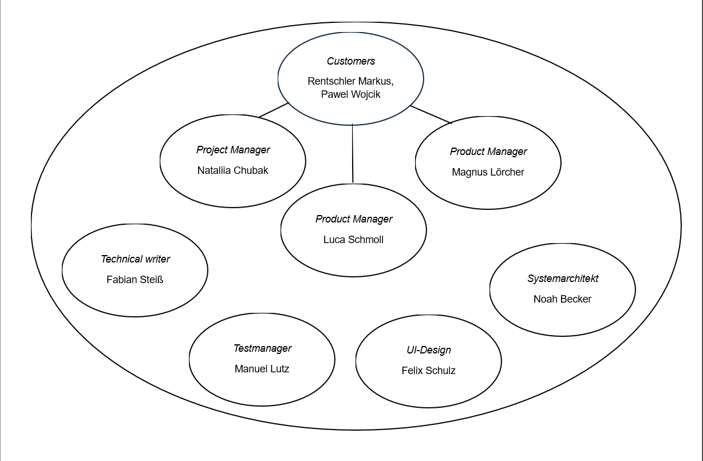
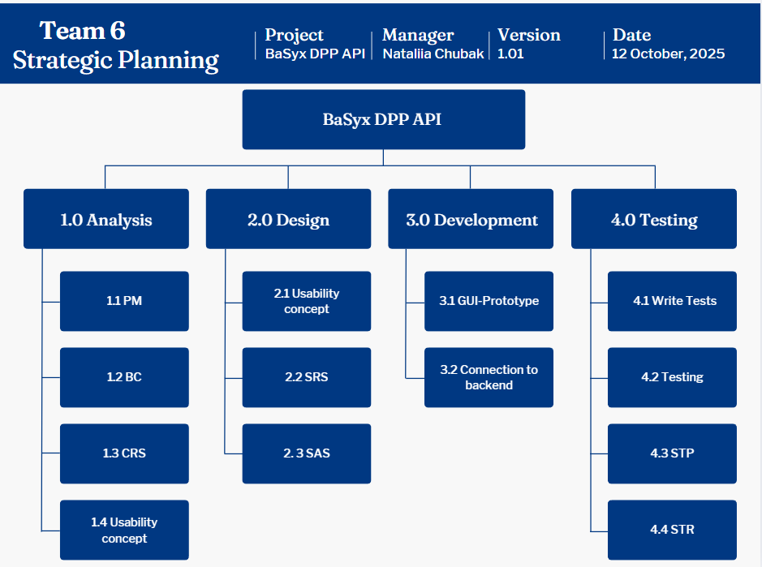
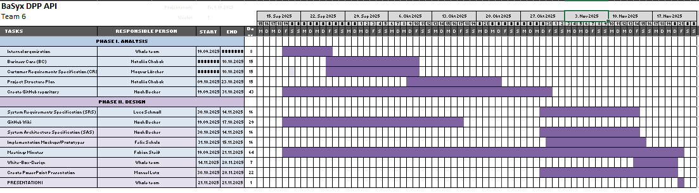
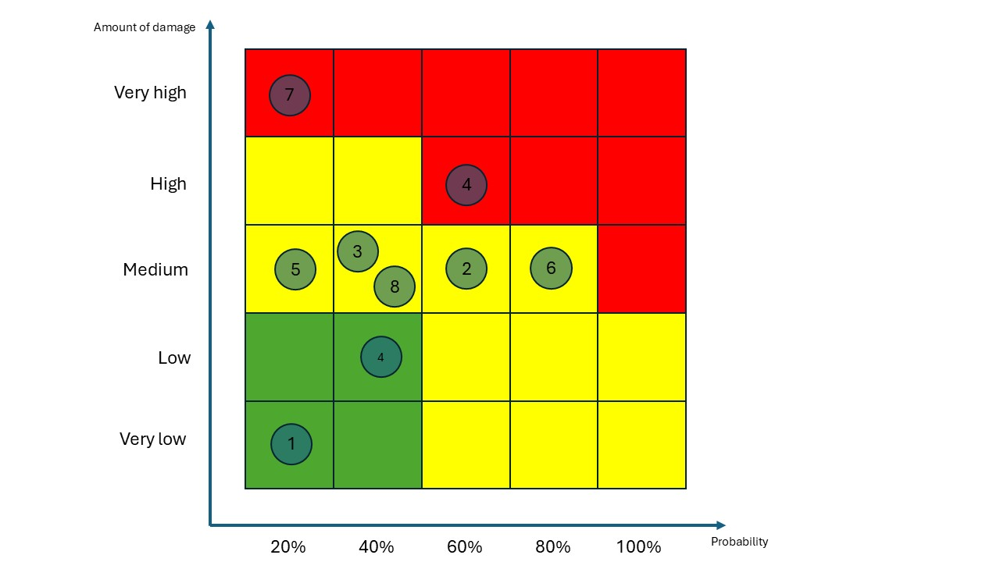

# PROJECT MANUAL: BaSyx DPP API

**TIN24F, SWL Practice project 2025/2026**

| | |
| :--- | :--- |
| **Author:** | Nataliia Chubak |
| **Project:** | BaSyx DPP API |
| **Clients:** | Rentschler Markus, Pawel Wojcik |
| **Address:** | Lerchenstraße 1, 70178 Stuttgart |

---

## Team 6: 

| **Position** | **Name** | **e-Mail** |
| :--- | :--- | :--- |
| Project Manager | Nataliia Chubak | `<inf24271@lehre.dhbw-stuttgart.de>` |
| Product Manager | Luca Schmoll | `<inf24137@lehre.dhbw-stuttgart.de>` |
| Product Manager | Magnus Lörcher | `<inf24155@lehre.dhbw-stuttgart.de>` |
| Test Manager | Manuel Lutz | `<inf24224@lehre.dhbw-stuttgart.de>` |
| System Architect | Noah Becker | `<inf24038@lehre.dhbw-stuttgart.de>` |
| Technical Writer | Fabian Steiß | `<inf24138@lehre.dhbw-stuttgart.de>` |
| UI-Designer | Felix Schulz | `<inf24075@lehre.dhbw-stuttgart.de>` |

---

## Version Control

| **Version** | **Date** | **Author** | **Comment** |
| :--- | :--- | :--- | :--- |
| 1.0 | 12.10.2025 | Nataliia Chubak | Created and added structure |
| 2.0 | 14.10.2025 | Nataliia Chubak | Added Milestones, Project Organisation and Gantt chart |
| 3.0 | 15.10.2025 | Nataliia Chubak | Risks analysis with suggestions from Luca Schmoll |
| | | | |

---

## Table of Contents

1.  [Project Assignment](#project-assignment)
2.  [Project Context](#project-context)
3.  [Project Organisation](#project-organisation)
4.  [Milestones](#milestones)
5.  [Gantt chart 3rd Semester](#gantt-chart-3rd-semester)
6.  [Risks](#risks)
7.  [Soft- and Hardware requirements](#soft--and-hardware-requirements)
8.  [Communication and reporting](#communication-and-reporting)
9.  [End of project](#end-of-project)

---

## Project Assignment

| **Field** | **Details** |
| :--- | :--- |
| **Project Goal (Output)** | Development of a two-sided (Backend-Frontend) REST-API Digital Product Passport (DPP) solution in the BaSyx framework according to DIN standards. |
| **Project Use (Outcome)** | Standardized lifecycle management, improved DPP search capability, and increased service efficiency. |
| **Project Clients** | Rentschler Markus, Pawel Wojcik |
| **Team members** | Nataliia Chubak, Luca Schmoll, Magnus Lörcher, Manuel Lutz, Fabian Steiß, Noah Becker, Felix Schulz |
| **Main tasks** | Analysis, Design, Coding, Documentation, Testing |
| **Budget** | Can be found in the Business Case (BC) |
| **Timeline of the project** | Start: Introductory lecture, 19.09.2025; End: Final presentation and project delivery, #.#.2026 |

---

## Project Context

| **Topic** | **Details** |
| :--- | :--- |
| **Initial Situation** | During the project, we need to create and implement a REST API for a digital product passport (DPP). The project development involves the use of Eclipse BaSyx Framework, which includes frontend and backend. In addition, the project is also characterised by existing standard requirements and the lack of implementation of this standard in the Eclipse BaSyx platform. |
| **Temporal context** | An open-source platform BaSyx  developed in 2023 for the development and use of digital twins in the context of Industry 4.0.  |
| | Project phase: Full implementation of the API, hosting on a demo server, and acceptance in the open source project. |
| | Post-project phase: The BaSyx framework is enhanced with the standards-compliant DPP API, which increases interoperability.|

### Stakeholder Analysis

| **Stakeholder** | **Potential / Chance** | **Conflict / Risk** | **Actions** |
| :--- | :--- | :--- | :--- |
| Customer | Satisfied with the project | Changing the requirements during the project | Regular communication between supplier and customer|
| Supplier | Development of the solutions that meets the requirements | Miscommunication, Time pressure | Regular meetings, Structured project leading|
| User | Uses the system  | Needs more information or does not understand the provided documentation, Incorrect operation | Make documentation clear and easy to get. Create the usability concept and testing of catching errors |

---

## Project Organisation

| **Position** | **Description** | **Name** |
| :--- | :--- | :--- |
| Customer | Provides project | Rentschler Markus / Pawel Wojcik |
| Project Leader | Manages the project, monitors the progress of tasks | Nataliia Chubak |
| Project Team | Specialized on different tasks | |
| | - Product Manager | Luca Schmoll |
| | - Product Manager | Magnus Lörcher |
| | - System Architect | Noah Becker |
| | - Test Manager | Manuel Lutz |
| | - Technical Writer | Fabian Steiß |
| | - UI-Design | Felix Schulz |

*Figur.1* Project organisation

### Work breakdown structure (PSP)

*Figur.2* Work breakdown structure (PSP)
---

## Milestones

| **WP-Code** | **Milenstone name** | **Responsible Person** |
| :--- | :--- | :--- | 
| W1 | *Analysis*: <ul><li>Official project start</li><li>First meeting, task distribution</li></ul> | Whole Team |
| W2 | *Analysis*: <ul><li>Create project structure, time scope (first version)</li><li>Create BC</li><li>Start analysing the requirements</li></ul>  |  <ul><li>Nataliia Chubak</li><li>Nataliia Chubak</li><li>Nataliia Chubak, Magnus Lörcher, Luca Schmoll</li></ul> |
| W3 | *Analysis*: <ul><li>Set up GitHub repository</li></ul>  | Noah Becker |
| W4 | *Analysis/Design*: <ul><li>Create CRS (first version)</li><li>Create usability concept</li></ul>  | <ul><li>Nataliia Chubak, Magnus Lörcher, Luca Schmoll</li><li>Nataliia Chubak, Magnus Lörcher, Luca Schmoll, Fabian Steiß, Felix Schulz, Noah Becker</li</ul> |
| W5 | *Design*: <ul><li>Create mockups</li><li>Create SRS</li><li>Create SAS</li></ul>  |  <ul><li>Felix Schulz</li><li>Fabian Steiß</li><li>Noah Becker</li></ul> |
| W6 | *Presentation*: <ul><li>Create powerPoint file</li><li>Prepare for presentation</li><li>Push PM, BC, CRS, SRS, SAS, Meetings protocols in final version in the GitHub repository</li></ul> *Development*: <ul><li>Start with development</li></ul>  |  <ul><li>Manuel Lutz</li><li>Whole team</li><li>Whole team</li></ul><ul><li>Whole team</li></ul> |

### List of tasks and responsible person

| **Person** | **Work package** | **Task** |
| :--- | :--- | :--- |
| **Nataliia Chubak** | Role: Project manager | - Planning & control |
| *E-mail: inf24271@lehre.dhbw-stuttgart.de* | - Analysis | - Usability concept |
| *MatrikelNr: 6401719* | - Design | - BC (Business Case) |
| | - Development | - PM (Project Manual) |
| | | - CRS (Customer Requirement Specification) |
| | | - Coding |
| | | - Presentation |
| | | - PowerPoint |
| **Magnus Lörcher** | Role: Product manager | - Market and demand analysis |
| *E-mail: Inf24155@lehre.dhbw-stuttgart.de* | - Analysis | - Usability concept |
| *MatrikelNr: 6699202* | - Design | - CRS |
| | - Development | - SRS (Software Requirement Specification) |
| | | - Coding |
| | | - Presentation |
| **Luca Schmoll** | Role: Product manager | - Market and demand analysis |
| *E-mail: Inf24137@lehre.dhbw-stuttgart.de* | - Analysis | - Usability concept |
| *MatrikelNr: 5919706* | - Design | - CRS |
| | - Development | - SRS |
| | | - Coding |
| | | - Presentation |
| **Fabian Steiß** | Role: Technical writer | - STR (Software Test Report) |
| *E-mail: Inf24138@lehre.dhbw-stuttgart.de* | - Documentation | - Usability concept |
| *MatrikelNr: 5934347* | - Design | - Meetings Minutes |
| | - Development | - User Manual |
| | | - Readme |
| | | - Coding |
| | | - Presentation |
| **Manuel Lutz** | Role: Test manager | - STP (Software Test Plan) |
| *E-mail: Inf24224@lehre.dhbw-stuttgart.de* | - Design | - Test planning |
| *MatrikelNr: 9414567* | - Development | - Test execution |
| | - Testing | - Coding |
| | | - Testing |
| | | - Presentation |
| **Noah Becker** | Role: System Architect | - SAS (Software Architecture Specification) |
| *E-mail: inf24038@lehre.dhbw-stuttgart.de* | - Analysis | - Backend implementation |
| *MatrikelNr: 1871817* | - Design | - Infrastructure setup |
| | - Development | - GitHub Repository |
| | | - Usability concept |
| | | - Coding |
| | | - Presentation |
| **Felix Schulz** | Role: UI-Designer | - UI-implementation |
| *E-mail: inf24075@lehre.dhbw-stuttgart.de* | - Design | - Prototyping |
| *MatrikelNr: 3954527* | - Development | - BaSyx analysis |
| | - Testing | - Coding |
| | | - Testing |
| | | - Presentation |
| | | - PowerPoint |

---

## Gantt chart 3rd Semester

*Figur.3* Gantt chart 3rd Semester

---

## Risks

| **Nr** | **Risk** | **Probability** | **Amount of damage** | **Effects** | **Measure** |
| :--- | :--- | :--- | :--- | :--- | :--- |
| 1 | Planning risk| 20 % | Very low | The project might take longer than planned. | Creating a detailed project work plan and systematically monitoring of the progress.  |
| 2 | Communication risk | 40 % | Low| Insufficient communication between team members. | Holding regular meetings and use the GitHub and Jira services. |
| 3 | Miscommunication with client | 40 % | Medium | Final product might not satisfy customer. | Presenting parts of the project during developing. |
| 4 |Technical risk| 60 % | High | Technical complexity of BaSyx. |  Evaluation and expansion of BaSyx teaching aids. |
| 5 |Risk of ignoring risks | 20 % |Medium| Insufficiently realistic assessment of scenarios by each member of the test team. | Creating a list of possible risks and possible solutions. | 
| 6 | Budget risk | 80 % | Medium | The budget for the project is being significantly exceeded. | Good planning and concentrating on main task. | 
| 7 | Cyber attack| 20 % | Very high | The servers are hacked; data is lost. | Encryption of the server. | 
| 8 | Illness | 40 % | Medium | Depending on the duration of the illness, several days/weeks.| In the event of long-term illness, the tasks assigned to the team member may be transferred to other team members. | 

*Figur.4* Risk matrix
---

## Soft- and Hardware requirements

*Software requirements:* OS: MS Windows, Linux, macOS.

*Hardware requirements:*
   
   • 32-bit (x86) or 64-bit (x64) processor with a clock speed of 1 GHz or faster;
   
   • 512 megabytes (MB) of RAM.

*Communication:* Teams, WhatsApp.

*Tools:* GitHub, Jira.

---

## Communication and reporting

* **Within the team:** 

Meetings are every week. Meetings are held on the university premises. They are protocolled. Fabian Steiß is responsible for the protocols. 
At each meeting, every team member receives a task. In addition, every week, everyone reports on the progress of the task and any problems that may have arisen. The Teams platform is also used for communication, if clarification of a specific task is needed.
The Jira platform is also used for more detailed control over the progress of tasks, which is also convenient for the team.

* **With the customer:**

All documents are visible in the GitHub repository. The documents PM, BC, CRS, SAS, SRS and MeetingMinutes are in the PROJECT folder.

---

## End of project

The project's deadline is officially set on **X.X.2026**.

The following tasks must be completed in the finished project:

* **Code:** The source code and an executable version have to be published on our **GitHub repository**.
* **GitHub:** The GitHub repository needs to be cleaned up, and its wiki has to be updated.
* **Documentation:** The complete set of documents must be delivered:
    * CRS (Customer Requirement Specification)
    * BC (Business Case)
    * SRS (Software Requirement Specification)
    * SAS (Software Architecture Specification)
    * Projektplan (Project Plan - PM)
    * MODs (Minutes of Decision - *likely included in Protocolls*)
    * STP (Software Test Plan)
    * STR (Software Test Report)
    * Benutzer Manual (User Manual)
    * Protokolle (Protocols/Meeting Minutes)
    * Sourcen (Source Code)
    * Executable
* **Product presentation**
