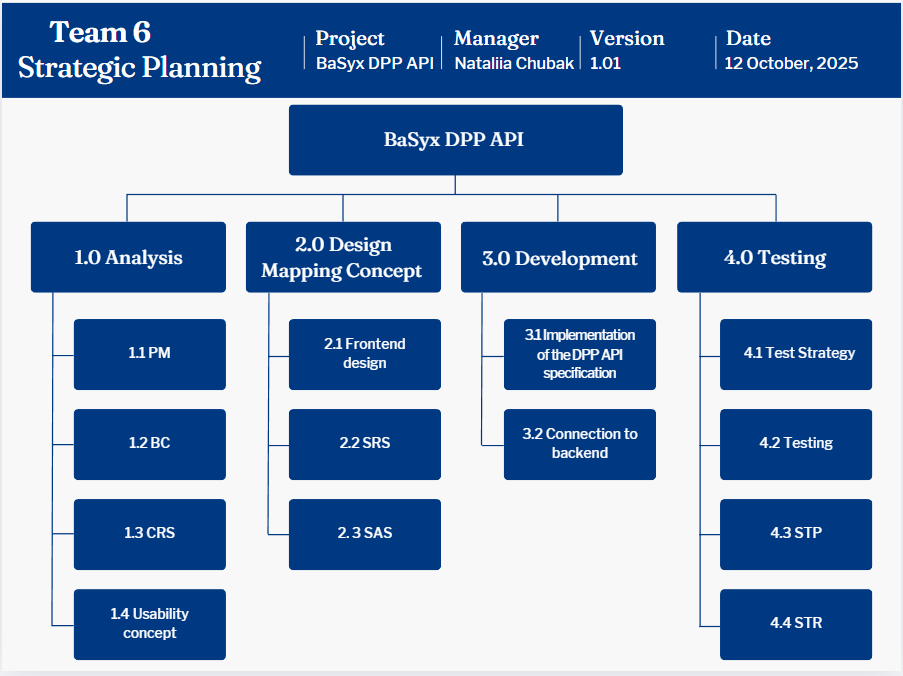

# Project structure plan: BaSyx DPP API

## Project 6: API for the Digital Product Passport (DPP) in the BaSyx Framework

### Customer
|Name|Mail|
|---|---|
|Markus Rentschler|rentschler@lehre.dhbw-stuttgart.de|
|Pawel Wojcik|pawel.wojcik@lehre.dhbw-stuttgart.de|

---

### Definition of tasks
 > **DIN EN 18222** “Digital product passport – Application programming interfaces (APIs) for product passport lifecycle management and searchability” describes a REST API that is to be implemented in the BaSyx framework as part of this task, both on the backend and frontend sides. The exact task can be found <a href="https://github.com/DHBW-TINF24F/.github/blob/main/project6_basyx_dpp_api.md">here</a>.

---

### Team 6
| **Name** | **e-Mail** | **Position** |
| :--- | :--- | :--- |
|  Nataliia Chubak | <inf24271@lehre.dhbw-stuttgart.de>|Project Manager |
|  Luca Schmoll | <inf24137@lehre.dhbw-stuttgart.de> |Product Manager |
|  Magnus Lörcher | <inf24155@lehre.dhbw-stuttgart.de>|Product Manager |
| Manuel Lutz |<inf24224@lehre.dhbw-stuttgart.de> |Test Manager | 
|  Noah Becker | <inf24038@lehre.dhbw-stuttgart.de> |System Architect |
|  Fabian Steiß | <inf24138@lehre.dhbw-stuttgart.de> |Technical Writer |
|  Felix Schulz |<inf24075@lehre.dhbw-stuttgart.de> |UI-Designer |

---

### Version Control

| **Version** | **Date** | **Author** | **Comment** |
| :--- | :--- | :--- | :--- |
| 1.0 | 12.10.2025 | Nataliia Chubak | Created and added structure |
| 2.0 | 14.10.2025 | Nataliia Chubak | Added Milestones, Project Organisation and Gantt chart |
| 3.0 | 15.10.2025 | Nataliia Chubak | Risks analysis with suggestions from Luca Schmoll |
| 4.0 | 21.10.2025 | Nataliia Chubak | Deliverables |
| | | | |

---

## Table of Contents

1.  [Project Assignment](#1-project-assignment)
2.  [Project Context](#2-project-context)
3.  [Stakeholder Analysis](#3-stakeholder-analysis)
4.  [Work breakdown structure](#4-work-breakdown-structure-psp)
5.  [Milestones and delivarebles](#5-milestones-and-deliverables)
6.  [Gantt chart 3rd Semester](#6-gantt-chart-3rd-semester)
7.  [Risks](#7-risks)
8.  [Soft- and Hardware requirements](#8-soft--and-hardware-requirements)
9.  [Communication and reporting](#9-communication-and-reporting)
10. [Project deliveries](#10-project-deliveries)

---

## 1. Project Assignment

The goal of the project is to develop a complete, two-sided REST API solution for the Digital Product Passport (DPP). This solution is to be implemented in the BaSyx framework and must comply with the relevant DIN standards.

The outcome of this project lies in the establishment of standardized lifecycle management. The implementation of the solution is intended to improve the searchability of the DPP and increase overall service efficiency.

The main tasks include the phases of analysis, design, coding, documentation, and testing. The budget for this project is specified in detail in the business case (<a href="https://github.com/DHBW-TINF24F/Team6-BaSyx-DPP-API/blob/main/PROJECT/BC/TINF24F_BC_Team_6_0v3.md">BC</a>). The project will officially begin with the introductory lecture on September 19, 2025, and end with the final presentation and project submission in 2026 (exact end date to be determined).

---

## 2. Project Context

During the project, we need to create and implement a REST API for a digital product passport (DPP). The project development involves the use of Eclipse BaSyx Framework, which includes frontend and backend. In addition, the project is also characterised by existing standard requirements and the lack of implementation of this standard in the Eclipse BaSyx platform. 

Time frame and phases:
- Platform basis: The BaSyx Framework is an open-source platform developed in 2023 for the development and use of digital twins in the context of Industry 4.0.
- Project phase: The current phase includes the complete implementation of the API, hosting on a demo server, and subsequent acceptance and integration into the open-source project.
- Post-project phase: After successful project completion, the BaSyx Framework will be expanded by the standards-compliant DPP API, which will significantly increase the interoperability of the platform.

## 3. Stakeholder Analysis

| **Stakeholder** | **Potential / Chance** | **Conflict / Risk** | **Actions** |
| :--- | :--- | :--- | :--- |
| Customer | Satisfied with the project | Changing the requirements during the project | Regular communication between supplier and customer|
| Supplier | Development of the solutions that meets the requirements | Miscommunication, Time pressure | Regular meetings, Structured project leading|
| User | Uses the system  | Needs more information or does not understand the provided documentation, Incorrect operation | Make documentation clear and easy to get. Create the usability concept and testing of catching errors |

---

## 4. Work breakdown structure (PSP)

 <i>Figur.1 Work breakdown structure (PSP)</i> 
 

---

## 5. Milestones and deliverables

### Phase I: Analysis

| Nr  | Milestone name             | Week   | Responsible person                  | Deliverable |
|-----|----------------------------|--------|-------------------------------------|-------------|
| M1  | Project-Kickoff            | 1      | Whole team                          | 1. Project kick-off protocol (protocol of the first meeting) 2. Task distribution matrix (roles and initial responsibilities) |
| M2  | Analysing the requirements | 2–4    | Nataliia Chubak, Magnus Lörcher     | 1. Detailed stakeholder analysis 2. Business case (BC) 3. Customer Requirements Specification (CRS) |
| M3  | Project plan               | 5–6    | Nataliia Chubak                     | 1. Project structure plan (initial rough schedule and scoping) 2. Initial product backlog (prioritised CRS requirements) |

### Phase II: Design

| Nr  | Milestone name                        | Week     | Responsible person                             | Deliverable |
|-----|----------------------------------------|----------|------------------------------------------------|-------------|
| M4  | Repository-Setup & Issue-Management    | 7        | Fabian Steiß, Noah Becker                      | 1. GitHub repository (basic structure) 2. Standard templates (README.md, PR templates) 3. Issue tracker setup (CRS, BC, SRS, SAS, STP, protocols) |
| M5  | Black-Box-Design (WHAT)                | 8–9      | Noah Becker, Luca Schmoll, Felix Schulz, Manuel Lutz | 1. Software Requirements Specification (SRS) 2. Software Architecture Specification (SAS) 3. Mockups/API design sketches, Usability/DX concept |
| M6  | White-Box-Design (HOW)                 | 9–10     | Whole team                                     | 1. Definition of modules and assignment as work packages |
| M7  | Final preparation                      | 11       | Whole team, Manuel Lutz                        | 1. Final project plan update (parallelised tasks, dependencies) 2. PowerPoint presentation (first version) |
| M8  | Semester-Review                        | 21.11.25 | Whole team                                     | 1. Presentation – results of analysis & design phase, final repository |

---

## 6. Gantt chart 3rd Semester

 <i>Figur.2 Gantt chart 3rd Semester (Phase I)</i> 
  

 <i>Figur.3 Gantt chart 3rd Semester (Phase II)</i> 
 

---

### List of tasks and responsible person

| **Person** | **Task** |
| :--- | :--- |
| **Nataliia Chubak**   | 
| Rolle: Project manager|  - Planning & control |
| *E-mail: inf24271@lehre.dhbw-stuttgart.de* |  - PSP (Project structure plan) |
| *MatrikelNr: 6401719* |  - BC (Business Case) |
| |  - Coding (Frontend)|
| |  - Presentation |
| |  - PowerPoint |
| | - Meetings Minutes (X-X Weeks)
| **Magnus Lörcher** |
| Role: Product manager |  - CRS (Customer Requirements Specification) |
| *E-mail: inf24155@lehre.dhbw-stuttgart.de* | - Market and demand analysis|
| *MatrikelNr: 6699202* | - Coding (Backend) |
| |- Usability concept |
| | - Presentation |
| **Luca Schmoll** | |
| Role: Product manager |- SRS (System Requirements Specification) |
| *E-mail: inf24137@lehre.dhbw-stuttgart.de* | -  Usability concept |
| *MatrikelNr: 5919706* | - Coding (Backend) |
| | - Market and demand analysis|
| | - Presentation |
| **Fabian Steiß** | |
| Role: Technical writer | - Meetings Minutes (1-11 Weeks)|
| *E-mail: inf24138@lehre.dhbw-stuttgart.de* |  - Usability concept |
| *MatrikelNr: 5934347* |  - User Manual |
| | - MOD    |
| | - Readme |
| | - Wiki   |
| | - Coding (Backend)|
| | - Presentation |
| **Manuel Lutz** | | 
| Role: Test manager | - STP (Software Test Plan) |
| *E-mail: inf24224@lehre.dhbw-stuttgart.de* | - STR (System Test Report)|
| *MatrikelNr: 9414567* | - Test execution |
| | - Test planning |
| | - GitHub Repository |
| | - Coding (full stack) |
| | - Testing |
| | - Presentation |
| | - PowerPoint I |
| **Noah Becker** | |
| Role: System Architect | - SAS (Software Architecture Specification) |
| *E-mail: inf24038@lehre.dhbw-stuttgart.de* | - Backend implementation |
| *MatrikelNr: 1871817* | - Infrastructure setup |
| | - Usability concept |
| | - Coding (Frontend) |
| | - Presentation |
| **Felix Schulz** | |
| Role: UI-Designer | - UI-implementation |
| *E-mail: inf24075@lehre.dhbw-stuttgart.de* | - Prototyping |
| *MatrikelNr: 3954527* |  - BaSyx analysis |
| | - Executable|
| | - MOD (Web-Interface) |
| | - Coding (Frontend) |
| | - Testing |
| | - Presentation |
| | - PowerPoint I |

---

## 7. Risks

| **Nr** | **Risk** | **Probability** | **Amount of damage** | **Effects** | **Measure** |
| :--- | :--- | :--- | :--- | :--- | :--- |
| 1 | Planning risk| 20 % | Very low | The project might take longer than planned. | Creating a detailed project work plan and systematically monitoring of the progress.  |
| 2 | Communication risk | 40 % | Low| Insufficient communication between team members. | Holding regular meetings and use the GitHub and Jira services. |
| 3 | Miscommunication with client | 40 % | Medium | Final product might not satisfy customer. | Presenting parts of the project during developing. |
| 4 |Technical risk| 60 % | High | Technical complexity of BaSyx. |  Evaluation and expansion of BaSyx teaching aids. |
| 5 |Risk of ignoring risks | 20 % |Medium| Insufficiently realistic assessment of scenarios by each member of the test team. | Creating a list of possible risks and possible solutions. | 
| 6 | Budget risk | 80 % | Medium | The budget for the project is being significantly exceeded. | Good planning and concentrating on main task. | 
| 7 | Cyber attack| 20 % | Very high | The servers are hacked; data is lost. | Encryption of the server. | 
| 8 | Illness | 40 % | Medium | Depending on the duration of the illness, several days/weeks.| In the event of long-term illness, the tasks assigned to the team member may be transferred to other team members. | 

 <i>Figur.4 Risk matrix</i> 
 

---

## 8. Soft- and Hardware requirements

| Component | Technology |
|------------|-------------|
| **Backend** | Java / Spring Boot (BaSyx SDK) |
| **API Definition** | OpenAPI 3.0 / Swagger |
| **Frontend** | React / TypeScript (BaSyx UI) |
| **Data Model** | Asset Administration Shell (AAS) |
| **Infrastructure** | Eclipse BaSyx Framework |
| **Hosting** | 
Traefik (Reverse Proxy) & Docker <li> [Swagger](https://srv01.noah-becker.de/uni/swe/swagger/) OpenAPI Spezifikation <li> [BaSyx WebUI](https://srv01.noah-becker.de/uni/swe/basyx/) Applikation
 |
| **Documentation** | Markdown, GitHub Wiki, Swagger UI |

---

## 9. Communication and reporting

* **Within the team:** 

Meetings are every week. Meetings are held on the university premises. They are protocolled. Fabian Steiß is responsible for the protocols. 
At each meeting, every team member receives a task. In addition, every week, everyone reports on the progress of the task and any problems that may have arisen. The Teams platform is also used for communication, if clarification of a specific task is needed.
The Jira platform is also used for more detailed control over the progress of tasks, which is also convenient for the team.

* **With the customer:**

All documents are visible in the GitHub repository. The documents PM, BC, CRS, SAS, SRS and MeetingMinutes are in the PROJECT folder.

---

## 10. Project deliveries
The project´s deadline (first part) is officially set on 21.11.2025.

Officially, the following tasks must be completed in the project (first part):
* **GitHub:** The GitHub repository needs to be cleaned up, and its wiki has to be updated.
* **Documentation:** The complete set of documents must be delivered:
    * CRS (Customer Requirement Specification)
    * BC (Business Case)
    * SRS (Software Requirement Specification)
    * SAS (Software Architecture Specification)
    * PSP (Project structure plan - PM)
    * Protokolle (Protocols/Meeting Minutes)
    * Mockups
* **Product presentation I**
