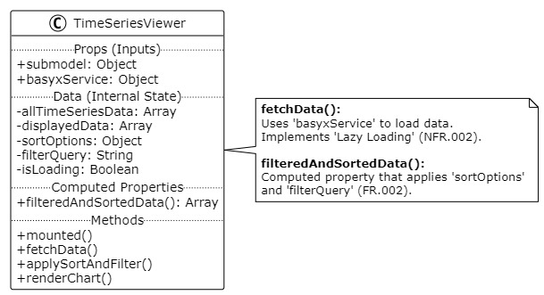
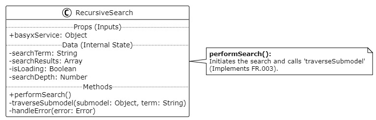

# Software Architecture Specification

## for [BaSyx Viewer Extension(Team II)]

**Prepared by:** [Jakob Pauls]
**Date:** [1.11.2025]

## Table of contents

- 1 [Introduction](#1-introduction)
- 1.1  [Purpose](#11-purpose)
- 1.2 [Scope](#12-scope)
- 2 [Architectural Goals](#2-architectural-goals-and-constraints)
- 2.1 [Architectural Drivers](#21-architectural-drivers)
- 2.2 [Constrains](#22-constrains)
- 3 [Whitebox](#3-architectural-views-white-box)
- 3.1 [Component Diagram](#31-component-diagram-logical-view)
- 3.2 [Class Diagrams](#32-class-diagrams-detailed-view)
- 4 [Key Design Decsions](#4-key-design-decisions)

## Revision History

| Name | Date | Reason for Changes | Version |
| :-- | :-- | :-- | :-- |
| 0.1 | 1.11.2025 | Jakob Pauls | text version |
| 1.0 | 1.11.2025 | Jakob Pauls | UML version |

***

## 1. Introduction

### 1.1 Purpose

This Software Architecture Specification (SAS) describes the White Box conceptual solution for The **BaSyx Viewer Extension** project. it details the internal components, their interactions and the key design descisions made to fulfill waht is outlined in the Software Requirements Specification (SRS).

### 1.2 Scope 

This architecture covers the development of new Vue.js components and plugins to enhance the existing Eclipse BaSyx AAS Web UI.

**This system will**
- Implement a new plugin for time-series visualization (`TimeSeriesViewer`)
- Implement enhanced filtering and sorting capabilities within viewer components (**FR.002**)
- Implement a new recursive search component (**FR.003**)
- Integrate a new `NameplateGenerator` component into the existing Digital Nameplate plugin (**FR.004**)
- Utilize *Lazy Loading* patterns to ensure performance (**NFR.002**)

**This system will NOT**
- Modify the core BaSyx backend services
- Change the existing database or API protocols beyond what is specified in **FR.005**

## 2. Architectural Goals and Constraints

### 2.1 Architectural Drivers

The architecture is driven by the following goals, derived from the \link{CRS} \link{PM}

#### Performance (**NFR.002**)
The UI must remain responsive. Search operations must complete within **30 seconds** and general UI interactions must not add more than **0.2s of latency**.  
This is the primary driver for the *Lazy Loading* design decision.

#### Modularity (**NFR.004**)
New features (Search, Nameplate Generator) must be implemented as distinct, maintainable components, integrating with the existing plugin structure where possible.

#### Usability (**NFR.001**)
The architecture must support complex user interactions, specifically:
- Recursive search (**FR.003**)
- Multi-key sorting (**FR.002**)

#### Integration (**FR.004**)
The architecture must allow for injecting a new component (`NameplateGenerator`) into an existing, third-party plugin (*Digital Nameplate*)

### 2.2 Constrains
- **Technology Stack**: The solution *must* be developed using **Vue.js** and **TypeScript** 
- **Preserved Functionality (FR.001)**: The new components *must* not alter or break any existing functionality of the core BaSyx Viewer
- **API Dependency (FR.005)**: The components rely on the capabilities of the BaSyx REST API. Performance of the UI search is dependent on the performance of the backend API

## 3. Architectural Views (White-Box)
This section provides the conceptual solution as required. The Architecture Diagram and Component Diagram are represented by the following Component View

### 3.1. Component Diagram (Logical View)

**Description**: This diagram shows the high-level components of the **BaSyx Viewer Extension** within the existing **BaSyx Web UI**.  
It highlights the new components — `RecursiveSearch`, `NameplateGenerator`, and `TimeSeriesViewer` — and their primary interaction partner, the existing `BasyxService`, which handles all API communication

**PlantUML**:

### 3.2. Class Diagrams (Detailed View)

#### 3.2.1. TimeSeriesViewer Component (for FR.002)

**Description**: This Vue component is responsible for visualizing time-series data. It has been updated to include internal state and methods for sorting and filtering, directly addressing **FR.002**

**PlantUML**:

#### 3.2.2. RecursiveSearch Component (for FR.003)

**Description**: This new component provides the global search functionality required by **FR.003**. It recursively traverses the AAS structure by making repeated calls via the `BasyxService`

**PlantUML**:

## 4. Key Design Decisions

1. **Component-Based Architecture**  
The solution is built as a set of loosely coupled **Vue.js components**, rather than modifying the core UI code.  
This adheres to **NFR.004 (Maintainability)** and simplifies integration

2. **Centralized Data Access**  
All new components must use the existing **BasyxService** for API communication.  
This maintains a single point of control for data access and error handling

3. **Lazy Loading Strategy**  
To meet **NFR.002 (Performance)** components like `TimeSeriesViewer` and `RecursiveSearch` will not fetch all possible data on initialization.  
Data will be loaded on-demand (when a user scrolls, expands a node, or applies a filter) to keep the UI responsive

4. **Diagrams as Code (PlantUML)**  
All architectural diagrams are created using **PlantUML**.  
This allows the SAS document to be version-controlled alongside the source code in Git, ensuring documentation stays synchronized with development and supporting **NFR.004 (Maintainability)**