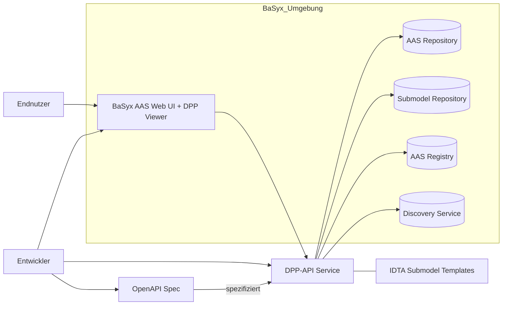
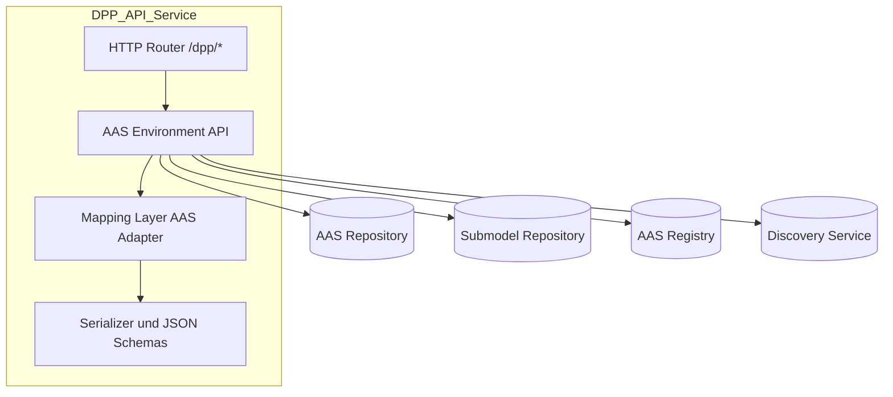
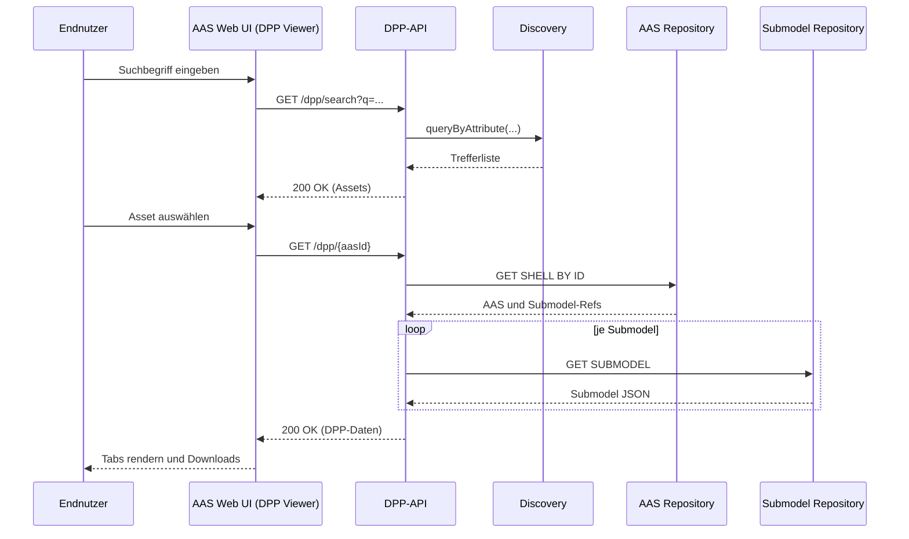
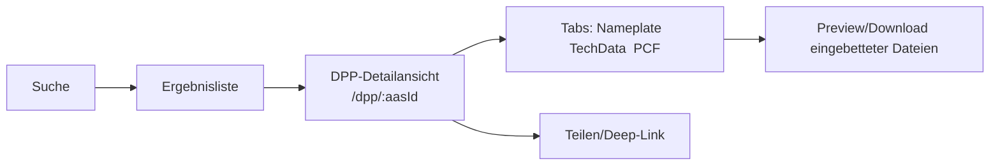
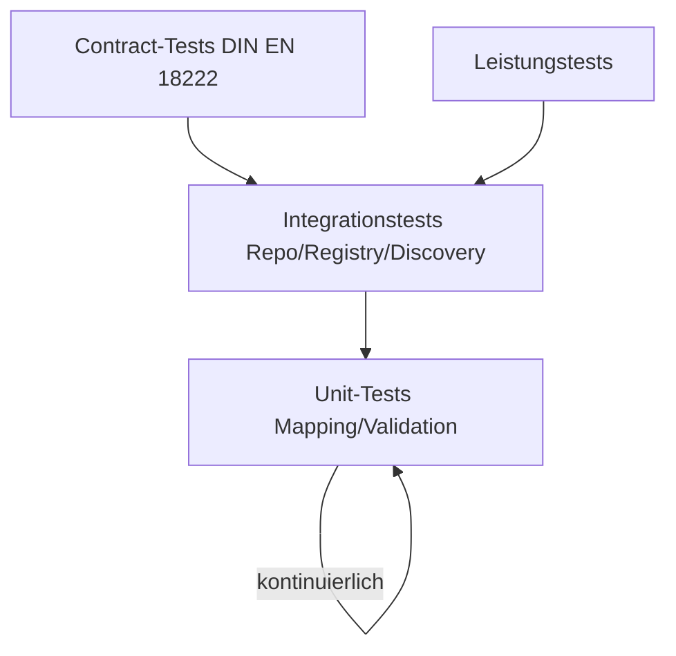

# Software Requirement Specification (SRS)
## Projekt 6: API für den Digitalen Produktpass (DPP) im BaSyx Framework
|Version|Autor|Datum|Kommentar|
|---|---|---|---|
|1.0|Luca Schmoll|04.11.2025|Ersterstellung der Grundstruktur|

1. [Zweck, Geltungsbereich und Referenzen](#1-zweck-geltungsbereich-und-referenzen)
    1. [Zweck](#11-zweck)
    2. [Anwendungsbereich](#12-geltungsbereich)
    3. [Begrifflichkeiten und Abkürzungen](#13-begrifflichkeiten-und-abkürzungen)
2. [Systemarchitektur](#2-systemarchitektur)
3. [Anwendungsfälle](#3-anwendungsfälle)
4. [Funktionale Anforderungen](#4-funktionale-anforderungen-fr)
    1. [Daten und API Anforderungen](#41-daten-und-api-anforderungen)
    2. [Frontend-Anforderungen](#42-frontend-anforderungen)
5. [Nicht-funktionale Anforderungen](#5-nicht-funktionale-anforderungen-nfr)
6. [Externe Schnittstellen](#6-externe-schnittstellen)
7. [Datenmodell und Semantik](#7-datenmodell-und-semantik)
8. [Usability Konzept & Workflows](#8-usability-konzept--workflows)
9. [Qualitätssicherung & Tests](#9-qualitätssicherung--tests)
10. [Build & Deployment-Vorgaben](#10-build--deployment-vorgaben)
11. [Dokumentation](#11-dokumentation)

---

## 1. Zweck, Geltungsbereich und Referenzen
### 1.1 Zweck
Dieses Dokument spezifiziert die funktionalen und nicht-funktionalen Anforderungen, die durch die Aufgabenstellung und die DIN EN 18222 vorgegeben werden und den Rahmen dieser Rest-API innerhalb der BaSyx Struktur bilden. Ziel ist eine konforme, testbare und hostbare Implementierung eines Backends und Frontends, samt OpenAPI-Spezifikation, Demoinstanz und Dokumentation.
Die primärem Ziele lassen sich wie folgt definieren:
1. Sicherstellung der **Normkonformität**
2. Nahtlose Integration ins BaSyx Framework
3. Ermöglichen des DPP Viewers im BaSyx AAS Web UI

### 1.2 Geltungsbereich
Im wesentlichen wird sich dieses Projekt auf die folgenden zwei Anwendungsbereiche beziehen:
1. **Backend**: BaSyx‑basierte Dienste (AAS Repository, Submodel Repository, Registry, Discovery) als Integrationskern; DPP‑API als Fassade zu AAS‑Strukturen.
2. **Frontend**: Erweiterung des BaSyx AAS Web UI für DPP‑spezifische Use Cases (Viewer, Suche, Routing, Visualisierung).
Die folgende Grafik dient als Übersicht der Projektstruktur und wie diese innerhalb des BaSyx Frameworks integriert werden soll.

 <i>Abbildung 1: Visuelle Übersicht des Projekts</i> 

### 1.3 Begrifflichkeiten und Abkürzungen
|Abkürzung|Bedeutung|
|---|---|
|DPP|Digitaler Produktpass|
|AAS|Asset Administration Shell|
|BaSyx|Open-Source Framework|
|Submodel|Teilstruktur eines AAS|
|OpenAPI|Industriestandard zur Beschreibung von API's|

## 2. Systemarchitektur
Die Lösung besteht aus den folgenden Architekturen:
1. **DPP-API Service:** Stellt die nach DIN EN 18222 definierten REST-Endpunkte bereit und mappt die Operationen auf BaSyx Kernfunktionen (Repository, Submodel, Registry, Discovery)
2. **BaSyx Kernkomponenten:** (Containerisiert via Docker): AAS Enviroment, AAS & Sumodel Registry, Discovery Service
3. **DPP Viewer im BaSyx Web UI:** Geführte Anzeige, Suche, Routing

Nahezu alle der REST-Endpunkte sollen auf bestehende BaSyx-API Aufrufe gemappt werden. Dieses Diagramm visualisiert, wie dieser Flow aussehen könnte.

 <i>Abbildung 2: Flow der API</i> 

## 3. Anwendungsfälle

### UC01 OpenAPI Spezifikation nach DIN EN 18222 erstellen
|||
|---|---|
|ID|UC01|
|Description|Der Entwickler erstellt eine syntaktisch und semantisch korrekte OpenAPI Spezifikation, die alle in der DIN EN 18222 genannten Resourcen, Endpunkte und Datenmodelle abbildet.|
|Roles involved|Entwickler (Backend)|
|Precondition|Die relevanten Abschnitte der DIn EN 18222 wurden analysiert und verstanden (FR-02)|
|Postcondition|Eine validierte .yaml Datei liegt im Repository vor und dient als Grundlage für die Implementierung (FR-01)|
|Triggering Event|Start des Projekts|

### UC02 Beispiel-Verwaltungsschalen (AAS/DPP) anlegen und registrieren
|||
|---|---|
|ID|UC02|
|Description|Der Entwickler lädt mindestens drei DPP-Beispiel-Verwaltungsschalen unter Verwendung der IDTA Submodel-Vorlagen (Nameplate, Techdata, etc.) hoch und registriert diese auf der lokalen BaSyx Umgebung|
|Roles involved|Entwickler (Backend)|
|Precondition|Die lokale BaSyx Infrastruktur ist lauffähig und die IDTA Submodel-Vorlagen sind bekannt.|
|Postcondition|Drei AAS-Instanzen mit für die DPP relevanten Submodellen (FR-08)|
|Triggering Event|Datenbasis notwendig für API-Mapping|

### UC03 DPP-API implementieren und BaSyx Mapping
|||
|---|---|
|ID|UC03|g
|Description|Die DPP-API wird implementiert und stellt die Endpunkte nach DIN EN 18222 bereit. Jede Anfrage wird intern auf die Standard AAS Endpunkte gemappt.|
|Roles involved|Entwickler (Backend)|
|Precondition|Die OpenAPI-Spezifikation (UC01) und die lokale BaSyx-Infrastruktur (UC06) sind vorhanden.|
|Postcondition|Ein Aufruf der DPP-Endpunkte löst eine korrekte Abfrage beim AAS Repository aus und liefert die DPP-Daten im erwarteten JSON-Format zurück (FR-02, FR-03).|
|Triggering Event|Implementierung der DPP-Funktionalität.|

### UC04 DPP-Daten im Viewer suchen und in Detailansicht anzeigen
|||
|---|---|
|ID|UC04|
|Description|Der Endnutzer navigiert im BaSyx AAS Web UI zur DPP-Ansicht, sucht nach einem Asset (z.B. nach Produktnamen) und wählt es aus. Das System ruft die Daten über die DPP-API ab und visualisiert die Submodelle (Nameplate, TechData, PCF) hierarchisch (FR-07, FR-UI-02).|
|Roles involved|Entwickler (Backend), Kunde, Entwickler (Frontend)|
|Precondition|Die DPP-API und der Viewer sind erfolgreich im BaSyx Web UI integriert.|
|Postcondition|Die Detailansicht des DPP ist geladen, Submodel-Tabs funktionieren und die Daten sind gemäß dem Usability-Konzept übersichtlich dargestellt.|
|Triggering Event|Notwendigkeit, einen Produktpass einzusehen|

Eine Suchanfrage innerhalb unseres Projektes könnte dann wie folgt aussehen:

 <i>Abbildung 3: Beispielhafter Durchlauf eines API-Calls</i> 

### UC05 Usability Konzept und Workflows definieren.
|||
|---|---|
|ID|UC05|
|Description|Definition eines Usability Konzepts um den DPP Viewer gemäß den Best Practices und der HARTING Lösung zu optimieren.|
|Roles involved|Product Owner, Entwickler (Frontend), UX-Designer|
|Precondition|Die Kernanforderungen an die Datenvisualisierung (FR-UI-02) sind bekannt.|
|Postcondition|Ein Usability-Konzept (z.B. Wireframes und eine Workflow-Beschreibung) liegt vor und dient als verbindliche Vorlage für die Frontend-Implementierung (FR-UI-01).|
|Triggering Event|Start der Frontend-Designphase.|

### UC06 Lokale Buildchain einrichten und beherrschen
|||
|---|---|
|ID|UC06|
|Description|Das Team forkt die benötigten BaSyx-Repositories, richtet die lokale Buildchain (Docker) ein und verifiziert, dass lokale Code-Änderungen erfolgreich gebaut und im Livesystem sichtbar werden|
|Roles involved|Entwickler, Systemarchitekt|
|Precondition|Die benötigten BaSyx-Repositories sind identifiziert (FR-11).|
|Postcondition|Der End-to-End-Zyklus (Ändern, Bauen, Testen) funktioniert und das Team ist mit der Buildchain vertraut.|
|Triggering Event|Start des Projekts.|

### UC07 Dokumentation erstellen
|||
|---|---|
|ID|UC07|
|Description|Die Lösung wird auf einem Demo-Server gehostet (NFR-04). Die Online-Dokumentation wird erstellt und im BaSyx-GitHub verlinkt.|
|Roles involved|Entwickler, Dokumentator|
|Precondition|Implementierung, Tests und Code-Reviews sind abgeschlossen.|
|Postcondition|Die Lösung ist öffentlich erreichbar. Die Dokumentation ist strukturiert verlinkt (FR-09). Pull Requests werden akzeptiert und die Lösung wird Teil des BaSyx-Projekts.|
|Triggering Event|Projektabschluss und Übergabe.|

## 4. Funktionale Anforderungen (FR)
### 4.1 Daten und API-Anforderungen
|ID|Anforderung|Priorität|Kriterium|
|---|---|---|---|
|FR-01|Es muss eine OpenAPI‑Spezifikation für die DPP‑API erstellt und im Repository hinterlegt werden|5 - Sehr hoch|Die Datei ist im Swagger-Editor anschaubar, bearbeitbar und ausführbar|
|FR-02|Die DPP‑API muss die in DIN EN 18222 beschriebenen Ressourcen, Operationen und Antwortcodes implementieren.|5 - Sehr hoch|Endpunkte/Parameter werden 1:1 aus dem Normtext abgeleitet und in OpenAPI abgebildet.|
|FR-03|DPP‑Operationen müssen auf AAS Endpunkte (Repository, Registry, Discovery) gemappt werden.|5 - Sehr hoch|Beispiel-Mapping: GET /dpp/{id} → AAS lesen (AAS Repository); POST /dpp → AAS/Submodel erstellen, Registrierung & Discovery-Eintrag.|
|FR-04|Volltext/Filter‑Suche über DPP‑Felder muss bereitgestellt werden; die Implementierung nutzt AAS Discovery.|4 - Mittel|Suche liefert Ergebnisse in unter 800 ms (NFR-03); Filterung nach mindestens zwei Attributen (z.B. Hersteller, Submodel-Name) ist möglich.|
|FR-05|Die API muss DPP‑Daten als JSON exportieren|4 - Mittel|Exportiere Dateien sind validierbar|
|FR-06|Mindestens drei Beispiel‑AAS mit DPP‑Submodellen (basierend auf IDTA-Vorlagen wie Nameplate, TechData, PCF) müssen geladen werden.|5 - Sehr hoch|Drei eigenständige AAS-Dateien existieren und sind im Demo-System registriert.|

### 4.2 Frontend-Anforderungen
|ID|Anforderung|Priorität|Kriterium|
|---|---|---|---|
|FR-07|Das BaSyx AAS Web UI muss einen DPP‑Viewer bereitstellen, der Submodel‑spezifische Ansichten (Nameplate/TechData/PCF) mit Previews und Routing‑Deep‑Links unterstützt.|5 - Sehr hoch|Ein Deep-Link (URL) zur DPP-Ansicht eines spezifischen Assets funktioniert und die Submodel-Daten werden strukturiert und nutzerfreundlich angezeigt|
|FR-08|Eine strukturierte Online‑Benutzerdoku (How‑to, Screenshots, API‑Referenz) muss im BaSyx‑Wiki/GitHub verlinkt werden.|4 - Mittel|Doku ist über das BaSyx-Wiki zugänglich und enthält Anleitungen für alle UC-01 bis UC-04.|
|FR-09|Die lokale Buildchain (Forken, Kompilieren, lokale Ausführung) muss etabliert sein.|5 - Sehr hoch|Eine minimale Code-Änderung (z.B. im UI-Titel) ist nach lokalem Build und Neustart des Docker-Stacks sichtbar.|

## 5. Nicht-funktionale Anforderungen (NFR)
|ID|Anforderung|Priorität|Kriterium|
|---|---|---|---|
|NFR-01|p95 Lesezugriffe < 300 ms bei 100 gleichzeitigen Requests.|4 - Mittel|Lasttestprotokoll weist eine Latenz unter 300 ms für 95% der Abfragen nach.|
|NFR-02|Suche p95 < 800 ms bei Index‑Treffer ≤ 10 k.|3 - Niedrig|Messung der Suchlatenz im Demo-Betrieb.|
|NFR-03|Containerisierte Bereitstellung via Docker Compose ist zwingend notwendig.|5 - Sehr hoch|Das gesamte Projekt ist über einen einzelnen Docker Befehl deploybar|
|NFR-04|Unterstützung BaSyx V2 und AAS V3 (insbesondere UI‑Kompatibilität und API‑Profile).|4 - Mittel|DPP-Daten, die AAS V2 oder V3 entsprechen, werden vom Viewer korrekt verarbeitet.|
|NFR-05|Das Projekt wird auf einem Public Server gehostet und ist darüber abrufbar und nutzbar.|4 - Sehr hoch|Das Projekt ist abrufbar über das Web.|

## 6. Externe Schnittstellen
|Schnittstelle|Standard|Nutzung durch DPP-API|
|---|---|---|
|AAS Repository/Submodel Repository|REST‑APIs|Kernfunktion: Speicherung und Abruf der DPP-Daten (Submodels).|
|AAS Registry/Discovery|REST-APIs|Zentrale Funktion: Registrierung des AAS und Suche nach AAS (DPP).|
|BaSyx AAS Web UI|Vue.js/Routing|Frontend nutzt die DPP-API Endpunkte.|

## 7. Datenmodell und Semantik
Ein DPP entspricht einer AAS mit den DPP-relevanten Submodellen. Die Struktur des DPP muss durch geeignete IDTA-Submodel-Templates erfüllt werden, die grob folgenden Aufbau haben:
1. Digital Nameplate:Identifikationsnummer/Regelungsinformation
2. Technical Data: Strukturierte, technische Eigenschaften
3. Carbon Footprint: CO2 Fußabdruck

## 8. Usability Konzept & Workflows
Das Usability-Konzept muss auf der Analyse des BaSyx-UI's basieren.
|Anforderung|Ziel|
|---|---|
|Ziele|Schnelle Erkennbarkeit zentraler DPP‑Informationen, klare Kontextwechsel (AAS zu Submodel), Barrierefreiheit.|
|Kern-Workflows|1. Produkt finden -> 2. AAS auswählen -> 3. DPP-Ansicht|
|Routing|Unterstützung von Teilen/Verlinken via Routing‑Deep‑Link.|
|Previews|Implementierung der Vorschau und des Downloads eingebetteter Dateien|

Grafisch modelliert könnte der Kern-Workflow wie folgt aussehen:

 <i>Abbildung 4: Workflow für das Suchen eines DPP</i> 

## 9. Qualitätssicherung & Tests
Die Qualitätssicherung für dieses Produkt muss mindestens folgendes umfassen:
|Art|Ziel|Methode|
|---|---|---|
|API-Konformität|Normtreue der Endpunkte (DIN EN 18222)|Contract-Tests|
|API-Konformität|Korrekte Abbildung der AAS Strukturen|Regelmäßige manuelle Prüfung|
|Funktionstests|Überprüfung der gesamten Use-Case‑Kette.|UC‑basierte Integrationstests.|
|Sicherheitstests|Schutz des Endpunktes|Pen-Test Szenario|
|Leistungstest|Einhaltung der Latenzzeiten|Lasttests|

Die Tests sollten dann in folgender Reihenfolge durchgeführt werden, um einen sinnvollen Workflow zu bilden:

 <i>Abbildung 5: Teststrategie</i> 

## 10. Build & Deployment-Vorgaben
|Umgebung|Vorgabe|Tooling|
|---|---|---|
|Lokal (Dev)|Isolierte Entwicklungsumgebung für den gesamten BaSyx-Stack.|Docker-Compose File|
|Demo‑Server|Öffentliche, internet-zugängliche Hosting-Instanz|Docker-Compose File|
|Konfiguration|Einfache Anpassung von Konfigurationen (Datenbanklinks, Passwörter, etc.)|Verwendung einer .env Datei|

## 11. Dokumentation
Eine Benutzerdokumentation muss im Repo zur Verfügung gestellt werden. Ebenfalls bedarf es einer technischen Dokumentation der entwickelten Features, welche dann auch im Repo verfügbar gemacht werden muss.
