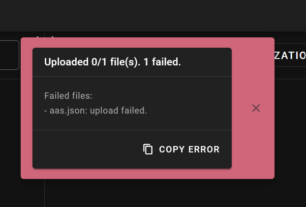
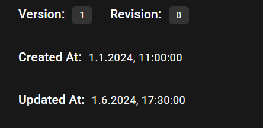

# System Test Report (STR)

**Project:** BaSyx Viewer Plugin Extensions  
**Test Case ID:** <TC.FIELDS.001.F>  
**Test Case Name:** Display and Integrity of Datetime Fields  
**Tester:** Mattis Weigold  
**Date:** 01.05.2026    
**Environment:** Firefox, Windows 10, Spring Backend    

---

## 1. Test Objective

Verify that the `createdAt` and `updatedAt` fields are correctly processed, transmitted, and displayed in the AAS Web UI.

---

## 2. Preconditions

- System is deployed and running
- Backend services are available
- Test dataset is prepared

---

## 3. Test Execution Summary

| Data Set ID | Executed (Y/N) | Result (Pass/Fail) | Notes |
|:--|:--|:--|:--|
| TD-001 | Y | Pass | Both fields imported and displayed |
| TD-002 | Y | Pass | `updatedAt` set to current datetime |
| TD-003 | Y | Pass | `createdAt` set to 1970-01-01 |
| TD-004 | Y | Pass | Both fields corrected |
| TD-005 | Y | Pass | AAS could not be imported. Error message shown in UI |
| TD-006 | Y | Pass | Both fields imported and displayed |
| TD-007 | Y | Pass | Both fields imported and displayed |
| TD-008 | Y | Pass | AAS could not be imported. Error message shown in UI |

---

## 4. Detailed Results

### TD-001 – Valid Datetime Fields
- **Expected:** Both fields displayed correctly  
- **Actual:** Both fields displayed. Same values as indicated from the json.  
- **Result:** Pass  
- **Comments:**  

---

### TD-002 – Only createdAt
- **Expected:** Only `createdAt` imported, `updatedAt` corrected    
- **Actual:** `createdAt` gets imported. `updatedAt` is set to current datetime.  
- **Result:** Pass  
- **Comments:**  

---

### TD-003 – Only updatedAt
- **Expected:** Only `updatedAt` imported, `createdAt` corrected  
- **Actual:** `updatedAt` gets imported. `createdAt` gets set to 1970-01-01.  
- **Result:** Pass  
- **Comments:** An indicator for a missing creation date might be better  

---

### TD-004 – No Fields
- **Expected:** No fields imported, both corrected  
- **Actual:** Both fields corrected like in test 002 and 003  
- **Result:** Pass  
- **Comments:**  

---

### TD-005 – Invalid Format
- **Expected:** Graceful handling (no crash, fallback display)  
- **Actual:** Error message popup in the UI states upload failed   
- **Result:** Pass  
- **Comments:** Error message does not indicate why the upload failed  

---

### TD-006 – Edge Cases (updatedAt in future)
- **Expected:** Correct display without UI issues  
- **Actual:** Both fields imported, both displayed correctly  
- **Result:** Pass  
- **Comments:** Fields get set regardless of their possibility  

---

### TD-007 – Switched Dates
- **Expected:** Correct display without UI issues   
- **Actual:** Both fields imported, both displayed correctly  
- **Result:** Pass  
- **Comments:** createdAt could be limited up to todays datetime  

---

### TD-008 – Impossible Date
- **Expected:** Graceful handling (no crash, fallback display)   
- **Actual:** Error message popup in the UI states upload failed  
- **Result:** Pass  
- **Comments:** No error details given  

---

## 5. Overall Result

**Final Result:** Pass  

**Summary:**
Dates get correctly displayed, but not internally corrected.    
Invalid formats or impossible dates cause an upload fail shown by an error popup.   

---

## 6. Recommendations

- Add more info to invalid upload popups regarding specific fields
- Automatically correct datetimes in the future
- Automatically correct nonexistent date ranges

---

## 7. Attachments

Failed upload popup:

Metadata Display (TD-001):
