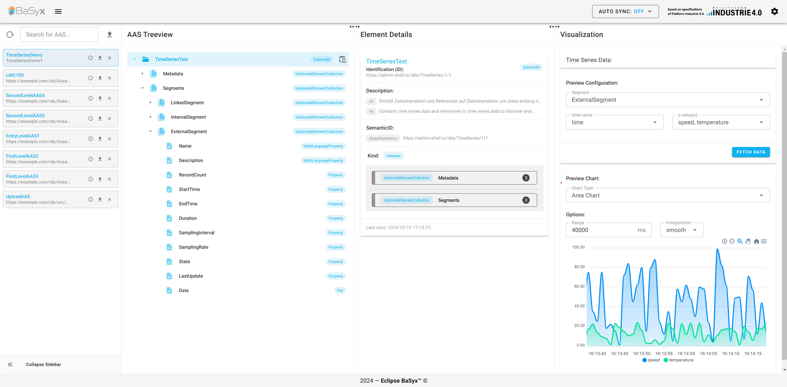

# Team 2 SWE

Dieses Projekt zielt darauf ab, die Web-UI des BaSyx-Tools
zu verbessern. Dabei wird hauptsächlich Wert auf Usability bei der Suchfunktion gesetzt.

# Das Team

| Name | Rolle | Github |
| ---- | ---- | ---- |
| Manuel Sposato​ | Projektleiter​ | [Manujpg](https://github.com/Manujpg) |
| Amon Rizzo​ | Produktmanager | [amon1220](https://github.com/amon1220)​ |
| Jakob Pauls​ | Systemarchitekt | [DJSkyRoad](https://github.com/DJSkyRoad) |
| David Ehrhardt​ | Systemarchitekt | [xyzyx4546](https://github.com/xyzyx4546)​ |
| Mattis Weigold​ | Testmanager | [Skullman-G](https://github.com/Skullman-G) |
| Laszlo Engemann​ | Technische Dokumentation​ | [Laszlo2025](https://github.com/Laszlo2025)​ |
| Matti Frey​ | Technische Dokumentation | [Matti2603](https://github.com/Matti2603) |

# Das Basisprojekt

Unser Projekt ist eine Weiterentwicklung und Fork der [basyx-aas-web-ui](https://github.com/eclipse-basyx/basyx-aas-web-ui), einer Web-Application mit Vue.js. Diese ermöglicht es sogenannte
Asset Administration Shells zu verwalten.
Mehr über AAS Dateien und weitere Informationen zu BaSyx können in der offiziellen [BaSyx-Dokumentation](https://wiki.basyx.org/en/latest/index.html) nachgelesen werden.

# Unser Projekt

[Unsere Projektanweisung](https://github.com/DHBW-TINF24F/.github/blob/main/project2_basyx_viewer_extension.md) besteht aus dem Erhalt und Aufbau der bereits bestehenden Funktionen im Frontend und der API.
Folgende neue Funktionen sind bereits geplant:
- Eine rekursive Suchfunktion
- Sortieren nach Schlüsselattributen in der Suche
- Nameplate Integration im Plugin: "Digital Nameplate"
- UI-Verbesserung durch Boolean Labeling

Weitere Details zur Planung und Verständigung sind auf unserer [Notion](https://shore-ambert-85d.notion.site/SWE-Hub-2e4958e5f3554007b4deb97139e785b3?pvs=74) Seite vorhanden.

