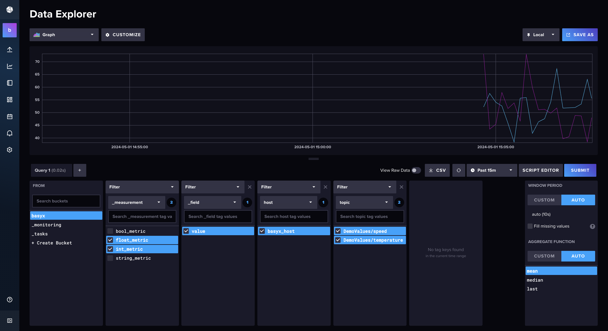
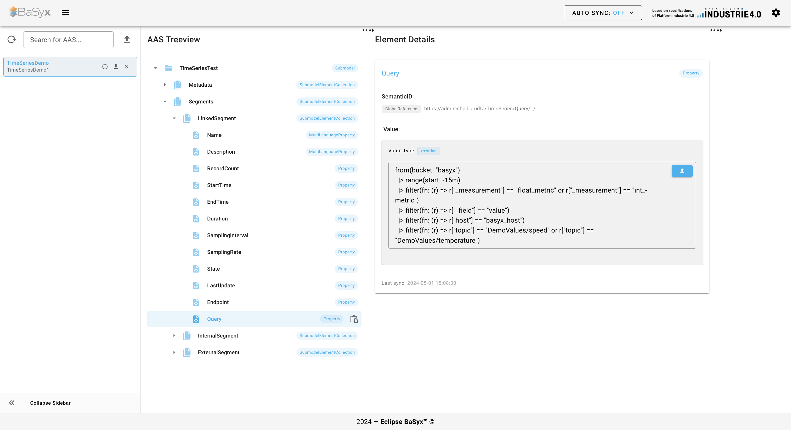

# AAS TimeSeries

This example includes a demo for the time series data plugin. It uses a BaSyx Go AAS Environment in `mono-all` mode with PostgreSQL, following the topology of the Combined Example. It is designed to be used with the time series data submodel template specified by the IDTA. The specification can be found [here](https://industrialdigitaltwin.org/wp-content/uploads/2023/03/IDTA-02008-1-1_Submodel_TimeSeriesData.pdf).

The plugin supports the following segment types:

- **InternalSegment**: This segment defines time series data within the AAS
- **ExternalSegment**: This segment defines time series data inside a file or blob SubmodelElement (the example includes a csv file as an example)
- **LinkedSegment**: This segment defines time series data inside a linked time series database (the example includes an InfluxDB together with telegraf for mqtt as an example)

## Getting Started

### Prerequisites

- Docker

This stack is intended for local demonstration only. It uses fixed demo credentials, a preconfigured InfluxDB administration token, and published host ports. Do not expose it to an untrusted network.

### Installing

1. Clone the repository
2. Run `docker compose up -d` in this directory

You can now access the AAS Web UI (http://localhost:3000) and InfluxDB UI (http://localhost:8086) in your browser.
The username and password for InfluxDB are `admin` and `influxpassword`.

The example uses the BaSyx Go and Web UI `SNAPSHOT` images and InfluxDB 2.7. Services with `pull_policy: always` are refreshed when the stack starts.

The BaSyx Go configuration service initializes the PostgreSQL schema and exits before the AAS Environment starts. The AASX package in `aas/` is then preloaded into the Go environment. To reset the persisted BaSyx data, run `docker compose down -v` before starting the example again.

## Usage

### Internal Segment

1. Open the AAS Web UI in your browser (http://localhost:3000)
2. Select the `SensorExampleAAS` AAS and click on the `TimeSeries` submodel in the treeview
3. In the `Visualization`-window select the `InternalSegment` in the Segment dropdown
4. Select `time` as time-value and, for example, `Temperature` as y-value
5. Click on `Fetch Data`
6. In the `Preview Chart`-window select a chart type
7. You should now see a chart with the time series data

### External Segment

1. Open the AAS Web UI in your browser (http://localhost:3000)
2. Select the `SensorExampleAAS` AAS and click on the `TimeSeries` submodel in the treeview
3. In the `Visualization`-window select the `ExternalSegment` in the Segment dropdown
4. Select `time` as time-value and, for example, `Temperature` as y-value
5. Click on `Fetch Data`
6. In the `Preview Chart`-window select a chart type
7. You should now see a chart with the time series data

### Linked Segment

Prerequisites:

1. Check if the query property of the `LinkedSegment` corresponds to the data you want to fetch from the database. If not, change the query property to the desired query (see images below).

   Queries copied from the InfluxDB Data Explorer or Grafana can use the time range selected in the AAS Web UI:

   ```flux
   from(bucket: "basyx")
     |> range(start: v.timeRangeStart, stop: v.timeRangeStop)
     |> filter(fn: (r) => r["_measurement"] == "machine_metric")
     |> filter(fn: (r) => r["_field"] == "{{y-value}}")
     |> aggregateWindow(every: v.windowPeriod, fn: mean, createEmpty: false)
   ```

   When **Fetch Data** is clicked, the Web UI replaces `v.timeRangeStart`, `v.timeRangeStop`, and `v.windowPeriod` with values calculated from the selected relative or absolute range. The existing `{{y-value}}` placeholder can still be used to inject the first selected y-variable. Other `v.*` variables must be defined by the Flux query itself.




1. Open the AAS Web UI in your browser (http://localhost:3000)
2. Select the `SensorExampleAAS` AAS and click on the `TimeSeries` submodel in the treeview
3. In the `Visualization`-window select the `LinkedSegment` in the Segment dropdown
4. Select `time` as time-value and, for example, `pressure` as y-value
5. If you see an input field for the InfluxDB Token, copy the token from the docker-compose.yaml file
6. Select a relative time range or enter an absolute start and end time
7. Click on `Fetch Data`
8. In the `Preview Chart`-window select a chart type
9. You should now see a chart with the time series data

You can always press the `Fetch Data` button again to update the chart with the latest data from the database.

### Auto Refresh

Auto refresh is disabled by default and initially uses a 30-second interval. Enable it in **Preview Configuration** and choose a positive interval in seconds, minutes, or hours. It starts once a segment, time variable, y-variable, and valid time range are selected, and it skips a tick while an earlier request is still running.

Each refresh resolves a relative LinkedSegment range against the current time, so the selected window advances with incoming data. Absolute ranges retain their exact start and end. InternalSegment relative ranges remain anchored to their newest available record, while ExternalSegment data is requested again and anchored to the newest timestamp returned by the file.

## Visualization Options

You can choose between the following chart types:

- Line Chart
- Area Chart
- Scatter Chart
- Histogram
- Gauge
- Display Field

For most of the chart types you can also alter some options. Those include:

- Relative time range presets, a custom value and unit, or an absolute start and end time
- Interpolation Mode
- Number of Bins (for Histogram)
- If Bars should be stacked (for Histogram)

Line, Area, and Scatter charts provide x-axis selection, zoom in/out, pan, and reset controls in the chart toolbar. Hovered values include their configured units, and the y-axis automatically scales to the visible data. Scrolling the page while the pointer is over a chart does not zoom it; zooming requires an explicit chart action. Auto refresh preserves a manual zoom so that an inspected section does not jump on every tick. Fetching a changed time range resets the viewport; the chart's reset control returns to the latest committed range.

Gauge values and labels remain visible without hovering. Selecting multiple y-values creates separate responsive gauges. Display Field rounds numeric values to two decimal places.

## Disclaimer

- The LinkedSegment was only tested with InfluxDB
- The ExternalSegment was only tested with csv files (RFC 4180 with header line) in a file SubmodelElement
